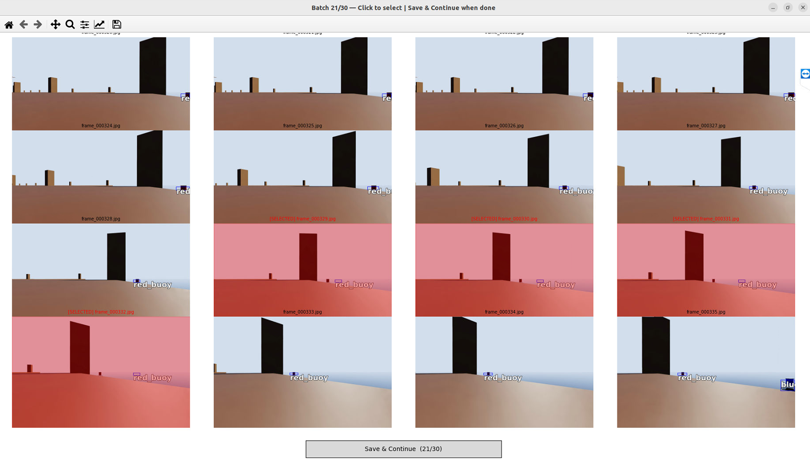
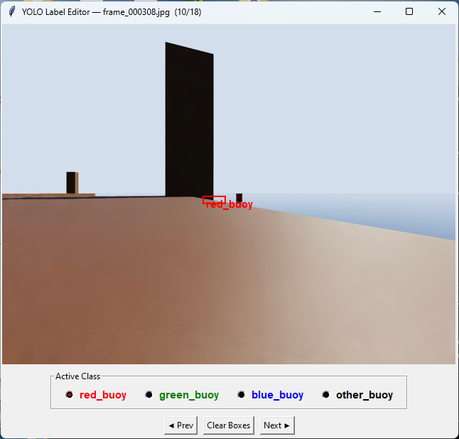
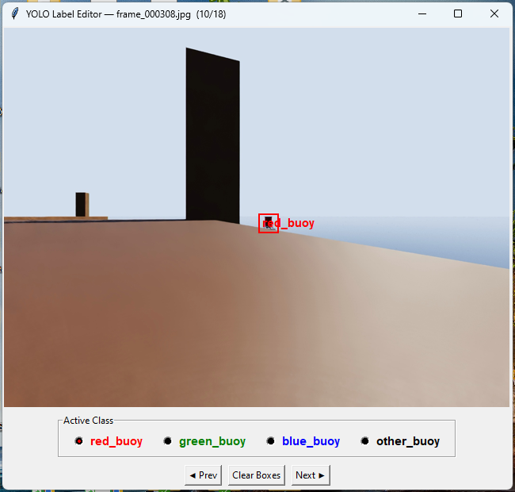

# Autolabeling Buoys for Robotx
This is designed to automatically label buoys like those used in the robotx competition. 

Existing labels can be verified and updated in most environments.

## Installation

Clone the repository

```bash
git clone https://github.com/scruz10FAU/autolabel.git
```

Install all dependencies

```bash
cd autolabel
pip install -r requirements.txt
```

The live label generator is designed to be run in an IsaacROS docker container, set up using instructions outlined by stereolabs with a ZED camera. [IsaacROS with ZED Cameras](https://www.stereolabs.com/docs/isaac-ros/setting_up_isaac_ros). Skip to [Label using folder of images](#label-using-folder-of-images) section if you are not running IsaacSIM. 

If you are running IsaacSIM and using zed cameras, you will also need to run the following commands for additional dependencies in the docker container:
```bash
python3 -m pip install --upgrade pip  
python -m pip install cython numpy opencv-python pyopengl  
cd "/usr/local/zed/"  
python3 get_python_api.py  
```

## Usage

### Detect buoys and label images

This detects buoys using the ZED cameras. It can be run using simulated cameras in IsaacSIM or actual physical cameras. 

```bash
python object_detection_with_boxes.py -v -s -m models/best_alex.onnx -st
```

This code won't work if you do not have a valid credentials file for the firebase database used

You can add arguments as follows when running the main program
| Flags | Data type | Function | options |
| -------------------------------- | -------- | ------------------------------------| ---------------------------- |
| `-ip`, `--ip_address` | str | IP address of the ZED camera stream | xxx.x.x.x |
| `--port` | int | Port for the ZED camera stream | any integer |
| `-m`, `--model_path` | str | Path to .onnx model for custom object detection | model path as a string|
| `-v`, `--visualize_output` | bool | Show output in a window (default False) | flag sets to True |
| `-s`, `--scale_down` | bool | Resize output down to 50% (default False) | flag sets to True |
| `-sv`, `--show_validation` | bool | Show validation overlays for detections (default False) | flag sets to True |
| `-r`, `--rotation` | int | Rotation value for the image | any integer |
| `-st`, `--save_training_data` | bool | Save images and YOLO labels for training (default False) | flag sets to True |
| `-o`, `--output_dir` | str | Output directory for training images and labels | directory path as a string|
| `-lc`, `--local_camera` | bool | Use a locally connected ZED camera instead of IP stream (default False) | flag sets to True |


### Label using folder of images

This runs YOLO auto-labeling on a folder of images (or other input source) and saves the resulting images and labels for training in Yolov8 

```bash
python autoLabelGen.py -m models/best_alex.pt -s buoy_images -t folder
```
Output is saved in the following format

```
training-directory/
├── images/
│   └── img0.jpg
├── labels/
    └── img0.txt
```

You can add arguments as follows when running the autoLabelGen program
| Flags | Data type | Function | options |
| -------------------------------- | -------- | ------------------------------------| ---------------------------- |
| `-m`, `--model` | str | Path to YOLO .pt model | model path |
| `-s`, `--source` | str | Camera index, video path, image folder, or ROS topic | path or index |
| `-t`, `--source-type` | str | Input source type (default: `folder`) | `camera`, `video`, `folder`, `ros` |
| `--out-images` | str | Output folder for labeled images | directory path |
| `--out-labels` | str | Output folder for YOLO label files | directory path |
| `-c`, `--conf` | float | Detection confidence threshold | float between 0 and 1 |
| `--blur` | float | Blur threshold (Laplacian variance); 0 to disable | float |
| `-v`, `--show` | bool | Show detections in a live window (default False) | flag sets to True |


### View and verify image labels

This displays saved training images with their YOLO bounding box labels overlaid. Images can be clicked to select them, and selected paths are appended to an output file for further review or correction.

```bash
python viewImages.py 
```

Images are viewed 16 at a time with the labels added. Click on images if their label is incorrect so they can be added to a queue for labels to be fixed. Images with incorrect labels will be highlighted in red, like shown below:



Selected images will be added to a list for use in the "Edit image labels" section.

You can add arguments as follows when running the viewImages program
| Flags | Data type | Function | options |
| -------------------------------- | -------- | ------------------------------------| ---------------------------- |
| `-i`, `--img_dir` | str | Directory of training images | directory path |
| `-l`, `--label_dir` | str | Directory of YOLO label files | directory path |
| `-o`, `--output_file` | str | File to append selected image paths | file path |
| `-c`, `--classes` | str | JSON file mapping class IDs to name and color | json path |

### Edit image labels

This opens a tkinter GUI for manually drawing, editing, and deleting YOLO bounding boxes on training images. If a `to_update_file` exists, only those images are loaded; otherwise all images in the image directory are shown. 

```bash
python labeleditor.py -i training_data/images -l training_data/labels -c classes.json
```

Right-click a box to delete it, and use the Prev/Next buttons to navigate and auto-save.



Select the correct class and redraw the box to fix the label


You can add arguments as follows when running the labeleditor program
| Flags | Data type | Function | options |
| -------------------------------- | -------- | ------------------------------------| ---------------------------- |
| `-i`, `--image_dir` | str | Directory of training images | directory path |
| `-l`, `--label_dir` | str | Directory of YOLO label files | directory path |
| `-u`, `--to_update_file` | str | File listing image paths to review | file path |
| `-c`, `--classes` | str | JSON file mapping class IDs to name and color | json path |

The classes JSON file should follow this format:
```json
{
    "0": {"name": "red_buoy",   "color": "red"},
    "1": {"name": "green_buoy", "color": "green"}
}
```
